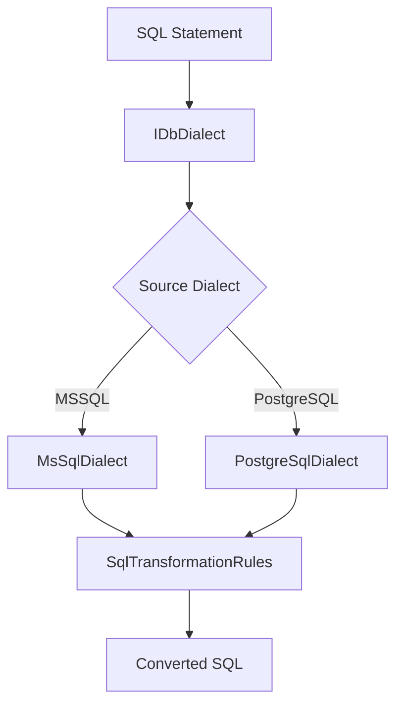

# DotNetAgents.Database.Dialects

Database dialect abstraction for converting SQL between different database systems.

## Overview

This package provides abstractions for handling SQL syntax differences between database systems, enabling automatic conversion of SQL statements, views, stored procedures, and data types.

## Features

- **Dialect Abstraction**: `IDbDialect` interface for database-specific SQL syntax handling
- **MSSQL Support**: Full MSSQL dialect implementation
- **PostgreSQL Support**: Full PostgreSQL dialect implementation with MSSQL-to-PostgreSQL conversion
- **Function Mappings**: 100+ built-in function mappings (GETDATE → CURRENT_TIMESTAMP, etc.)
- **Data Type Conversions**: Comprehensive data type mapping between dialects
- **Unsupported Construct Detection**: Identifies constructs that cannot be automatically converted

## Usage

### Basic Setup

```csharp
using DotNetAgents.Database.Dialects;
using Microsoft.Extensions.DependencyInjection;

// Register dialects
services.AddDatabaseDialects(sourceDialect: "MSSQL", targetDialect: "PostgreSQL");

// Get dialect factory
var dialectFactory = serviceProvider.GetRequiredService<IDbDialectFactory>();
var postgresDialect = dialectFactory.GetDialect("PostgreSQL");
```

### Converting SQL

```csharp
// Convert a SQL statement
var mssqlSql = "SELECT TOP 10 * FROM [Users] WHERE GETDATE() > CreatedDate";
var postgresSql = postgresDialect.ConvertSql(mssqlSql);
// Result: "SELECT * FROM \"Users\" WHERE CURRENT_TIMESTAMP > CreatedDate LIMIT 10"
```

### Converting Functions

```csharp
// Convert function calls
var converted = postgresDialect.ConvertFunction("GETDATE", Array.Empty<string>());
// Result: "CURRENT_TIMESTAMP"
```

### Converting Data Types

```csharp
// Convert data types
var postgresType = postgresDialect.ConvertDataType("NVARCHAR", maxLength: 255);
// Result: "VARCHAR(255)"
```

## Supported Conversions

### MSSQL to PostgreSQL

- **Functions**: GETDATE, LEN, CHARINDEX, SUBSTRING, ISNULL, IIF, and 100+ more
- **Data Types**: NVARCHAR → VARCHAR, DATETIME → TIMESTAMP, UNIQUEIDENTIFIER → UUID, etc.
- **Statements**: TOP N → LIMIT N, bracket identifiers → quoted identifiers
- **Views**: Full view definition conversion
- **Stored Procedures**: Conversion to PostgreSQL functions

## Architecture



## EF Core + Npgsql (runtime mapping vs dialect SQL)

This package converts **SQL text** between dialects. It does **not** configure **Entity Framework Core** column types or **Npgsql** value materialization.

If an app targets **PostgreSQL** but the database (or migrations) still reflect a **SQLite-style** layout—especially **`Guid`** and **`DateTimeOffset`** stored as **`text`**—**Npgsql 6+** may fail at read time with errors like *Reading as `System.Guid` / `DateTimeOffset` is not supported for fields having DataTypeName `text`*. **Mitigation:** in the relevant `DbContext.OnModelCreating`, when `Database.IsNpgsql()`, apply explicit **`ValueConverter`s** (string storage with ISO round-trip for `DateTimeOffset`) for affected properties, or migrate columns to native PostgreSQL types (`uuid`, `timestamptz`) and regenerate migrations.

**Reference implementation:** `AgentProjects/PromptSpecialistAgents` → `PromptSpecialistDbContext` (`ApplyPostgresSqliteCompatibleTextConverters`).

Sister package **`DotNetAgents.Database.Learning`** reuses dialects for pattern learning; the same EF runtime rule applies there when persisting to Postgres.

## Extension Points

- Implement `IDbDialect` for additional database systems
- Extend `SqlTransformationRules` for custom function mappings
- Override conversion methods for specialized behavior
